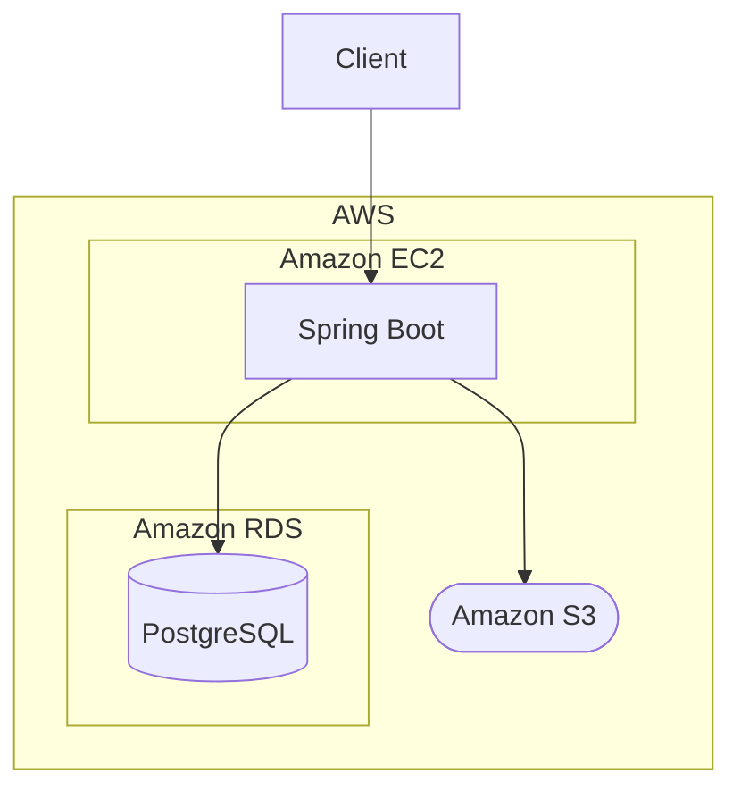
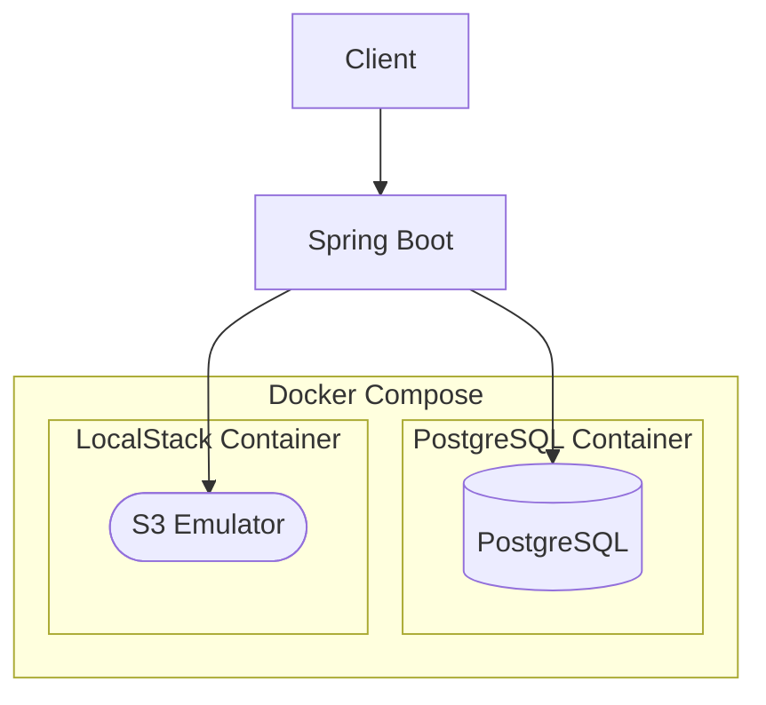

# Book Review API

## 概要
書籍とレビューを管理するREST APIです。  
Spring Bootで実装し、基本的なCRUD操作を提供します。

---

## 技術スタック
| カテゴリ | 使用技術 |
|----------|----------|
| 言語 | Java 17 |
| フレームワーク | Spring Boot 3 |
| ビルドツール | Maven |
| データベース | PostgreSQL |
| データアクセス | MyBatis |
| データベースマイグレーション | Flyway |
| API設計 | RESTful API |
| API仕様 | OpenAPI（Swagger） |
| クラウド | AWS（EC2、RDS、Amazon S3） |
| ローカル開発環境 | Docker Compose、LocalStack |
| テスト | JUnit 5、Mockito、Testcontainers |
| CI | GitHub Actions |

---

## システム構成図
### 本番環境


### ローカル環境


## 機能

### Book
- 書籍の作成 / 取得 / 更新 / 削除

### Book Image
- 書籍画像のアップロード
- 書籍画像の削除

### Review
- 書籍に対するレビューの作成 / 取得 / 更新 / 削除

---

## エンドポイント

### Book
- POST /books
- GET /books
- GET /books/{bookId}
- PATCH /books/{bookId}
- DELETE /books/{bookId}

### Book Image
- POST /books/{bookId}/images
- DELETE /books/{bookId}/images/{imageId}

### Review
- POST /books/{bookId}/reviews
- GET /books/{bookId}/reviews
- GET /books/{bookId}/reviews/{reviewId}
- PATCH /books/{bookId}/reviews/{reviewId}
- DELETE /books/{bookId}/reviews/{reviewId}

---

## 環境構築

### 必要条件
- Java 17

### 起動方法
```bash
./mvnw spring-boot:run
```

### ビルド
```bash
./mvnw clean package
```

### ビルドしたjarの実行
```
java -jar target/book-review-api-0.0.1-SNAPSHOT.jar
```

### OpenAPIからソースコードを生成

```bash
./mvnw clean generate-sources
```